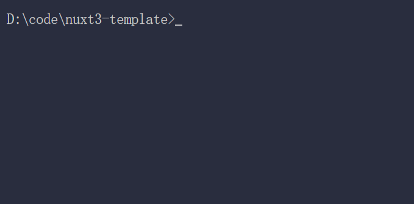

# ri
A rust version ni.

> [ni](https://github.com/antfu/ni) - 💡 Use the right package manager

<br>

<pre>
cargo install <b>rni</b>
</pre>

<a href='https://docs.npmjs.com/cli/v6/commands/npm'>npm</a> · <a href='https://yarnpkg.com'>yarn</a> · <a href='https://pnpm.js.org/en/'>pnpm</a> · <a href='https://bun.sh/'>bun</a>

<br>

### `ri` - install

```bash
ri

# npm install
# yarn install
# pnpm install
# bun install
```

<p align="left">
  
</p>

```bash
ri vite

# npm i vite
# yarn add vite
# pnpm add vite
# bun add vite
```

```bash
ri -f

# npm ci
# yarn install --frozen-lockfile
# pnpm i --frozen-lockfile
# bun install --no-save
```

### `ri r` - run

```bash
ri r dev

# npm run dev
# yarn run dev
# pnpm run dev
# bun run dev
```

Specially, you can use `ri rd` to run scripts `<agent> run dev`

```bash
ri r

# interactively select the script to run
# supports https://www.npmjs.com/package/npm-scripts-info convention
```


<p align="left">
  
</p>

### `ri un` - uninstall

```bash
ri un webpack

# npm uninstall webpack
# yarn remove webpack
# pnpm remove webpack
# bun remove webpack
```
## Other useful commands

### clean your workspace

- use `ri rm` to remove node_modules/**
- use `ri rl` to remove lockfile of current agent, like `yarn.lock` / `pnpm-lock.yaml` / `package-lock.json` / `bun.lockb`

### clone a repo

> you don't need to paste the url, just press enter

- step 1: copy the repo url
- step 2: `ri cl`


full command: `ri cl <url>`

<br>

### How?

**ri** assumes that you work with lockfiles (and you should)

Before it runs, it will detect your `yarn.lock` / `pnpm-lock.yaml` / `package-lock.json` / `bun.lockb` to know current package manager (or `packageManager` field in your packages.json if specified), and runs the [corresponding commands](https://github.com/JiatLn/ri/blob/main/src/agents.rs).

## License

[MIT](./LICENSE) License © 2022-Present [JiatLn](https://github.com/JiatLn)
